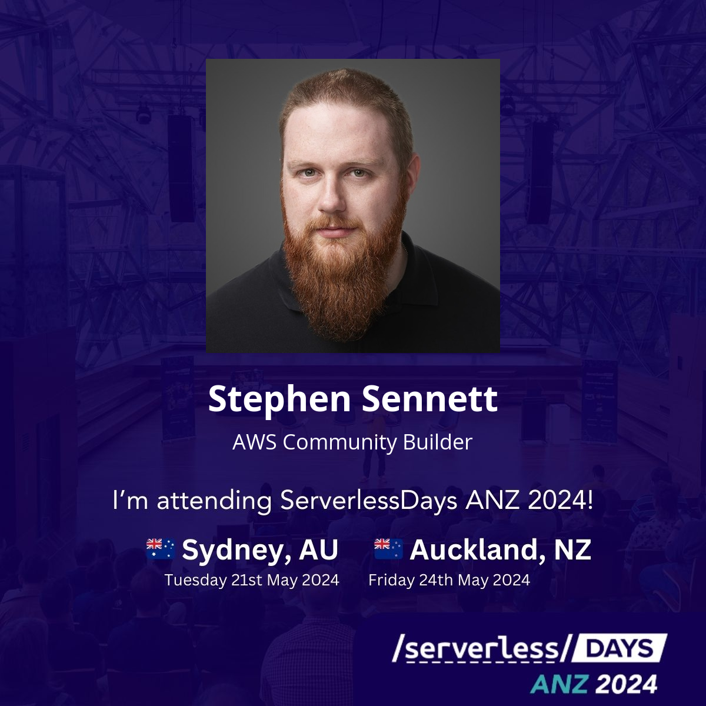

# ServerlessDays-SocialBadge

Creates dynamically generated social media badge posts for attendees to the ServerlessDays ANZ conference.



Built entirely with serverless tech on AWS Lambda, and API Gateway using SST. Uses the Python 3.11 runtime, with the [Pillow](https://pillow.readthedocs.io/en/stable/) image manipulation library from [KLayers](https://github.com/keithrozario/Klayers).

## Summary

Generated images are stored on an S3 bucket using the SHA256 key of the original request as a hash. This provides a rudimentary form of caching, so if someone generates the same thing twice, it will return significantly faster.

Based on the default configuration (1024MB memory) and assumptions of speed (up to 10s, usually much lower even from cold start), the cost of this solution is approximately $0.01 per 100 images.

## Deployment

This project has been built using the [SST v2](https://sst.dev/) framework, on top of the [AWS CDK](https://aws.amazon.com/cdk/). To deploy the project yourself, you simply need to install the necessary libraries, download the setup files, and deploy it using SST.

This project uses the [Open Sans](https://fonts.google.com/specimen/Open+Sans) font in the image generation. Due to restrictions on redistribution with the [Open Font License](https://openfontlicense.org/), I've opted not to include the fonts in the repo, and instead they can be directly downloaded using the `setup.py` script.

```bash
./setup.py
npm install
npx sst deploy --stage prod --profile <YOUR_AWS_CLI_PROFILE>
```

You can also run this project using the sst dev mode using their [Live Lambda](https://docs.sst.dev/live-lambda-development) functionality, which I highly recommend - very cool for testing.

## Customization

This project can be freely used and customized for use by other events and conferences (MIT License). There's a things you'll need to do to deploy it:

* Update the `src/template.jpg` with a background layer for your own events
* Update any fonts and coordinates within `src/slsdaysbadge.py` to make it relevant for your own project

The target bucket will be created by SST and populated into the Lambda function by an environment variable.

You can also find a sample of the HTML & JavaScript used to embed this in the front-end in our docs under [frontend.html](docs/frontend.html)
